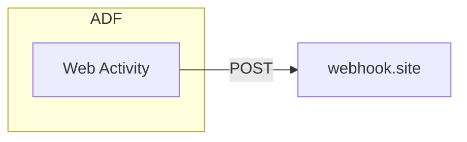
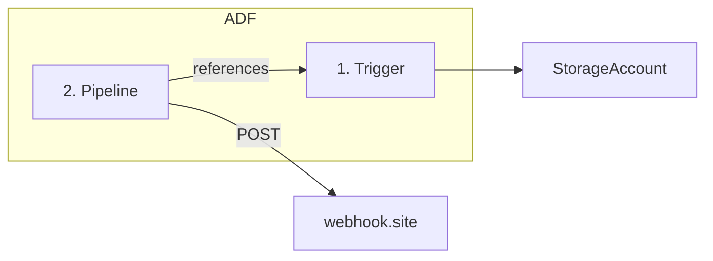

### Exercise #1: Hello World

Create a pipeline which sends "Hello World" as POST body to webhook.site.

Trigger pipeline manually.




---

### Exercise #2: File Watcher

As soon as a file is dropped in a folder, send file name to webhook.site



**Creation:**

1. Create trigger
2. Create pipeline
3. Connect pipeline to trigger

**To receive file name from trigger**

1. Add parameter to pipeline - use any name e.g. fn
2. Trigger > Edit > Click on 0 Parameters 
3. Set fn value:  @triggerBody().fileName

For folder path, use: @triggerBody().folderPath

**To use pipeline parameters in an activity:**

For example, to use in Web activity, POST body:

1. Click on hyperlink under Body textbox: "Add dynamic content"
2. Choose any parameter that you want to use. ADF will auto add: @pipeline().parameters.filename
3. Test via webhook.site


**References:**

- ADF Pipeline **Parameters vs Variables**: https://stackoverflow.com/a/60838239/2612429
  - Parameters: Fixed constants, set once. **Usage:** pipeline().parameters.{ParamName}
    - (so far) Parameters are set by external things e.g. triggers -- just like function parameters are send by its external callers (pipeline is like a function)
  - Variables: can be changed. **Usage:** variables('{VarName}')
- ADF functions e.g. concat two strings: https://learn.microsoft.com/en-us/azure/data-factory/control-flow-expression-language-functions#concat


---

### Exercise #3: ADF If-then

If file name starts with A, then send "Apple" to Webhook.site

If file name starts with B, then send "Banana" to Webhook.site


**Steps:**

1. Create a pipeline
2. Create a parameter (filename) for your pipeline
3. Connect pipeline to a trigger (which is connected to storage account)
   1. make sure than filename parameter value is set by trigger. @triggerBody().fileName
4. Optional: Create a new pipeline variable (varFileName)
   1. Use activity: Set Variable, to assign fileName parameter to varFileName
5. Add activity: If Condition, and connect it after Set variable
6. In activity expression: use function helper links to write this expression ```@startswith(variables('varfileName'), 'A')```
   1. Note that this check is **case insensitive**
7. In true, add activity: Web, which makes webhook.site calls with POST body of: Apple
8. In true, add activity: Web, which makes webhook.site calls with POST body of: Banana
9. Publish. Upload files and observe webhook.site for values.


---

### Exercise #4: Loops

Create a pipeline, which sends data to webhook.site based on uploaded filename.

Using file name (excluding extension), send a Web request with each part of the filename.

e.g. if file name is abc.txt, send 2 POST requests with body containing abc and txt

if file name is xyz.abc.txt, send 3 POST requests with body containing xyz, abc and txt


**Solution:**

ForEach Activity takes in an array.

1. Create a variable of type array e.g. parts

2. Assign that variable value based on split of file name by period.

   ```@split(variables('varfn'),'.')```

3. ForEach will iterate over the parts variables.

4. Inside ForEach, use a Web activity which uses @item   -- which represent current item in loop.


https://stackoverflow.com/a/62780464/2612429
